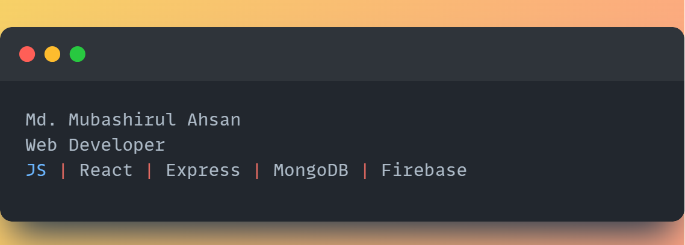

# 💫 About Me:
Welcome to my page! I'm Md. Mubashirul Ahsan, a web developer from  Sylhet, Bangladesh.

## 🌐 Socials:
  

# 💻 Tech Stack:
                       
# 📊 GitHub Stats:
 
 

### ✍️ Random Dev Quote

---

<!-- Proudly created with GPRM ( https://gprm.itsvg.in ) -->
